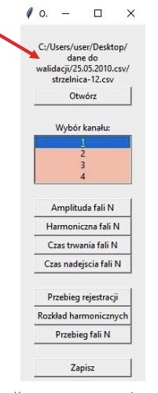
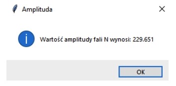
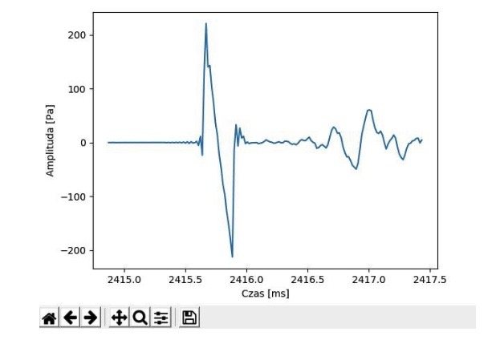
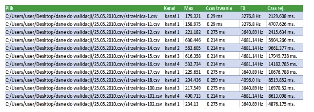

# praca_inzynierska

## Informacje
Repezytorium jest poswiecone mojej pracy inzynierskiej wykonanej w 2018 roku. Celem pracy bylo wykonanie programu w jezyku Python, z interfejsem graficznym,
ktory wyodrebnial i wykonywal wykres fali akustycznej na podstawie zarejestrowanych przebiegow (zapisanych w .csv), obliczal jej parametry oraz umozliwial
wyeksportowanie obliczonych parametrow do bazy danych.

## Przykladowe dzialanie programu

